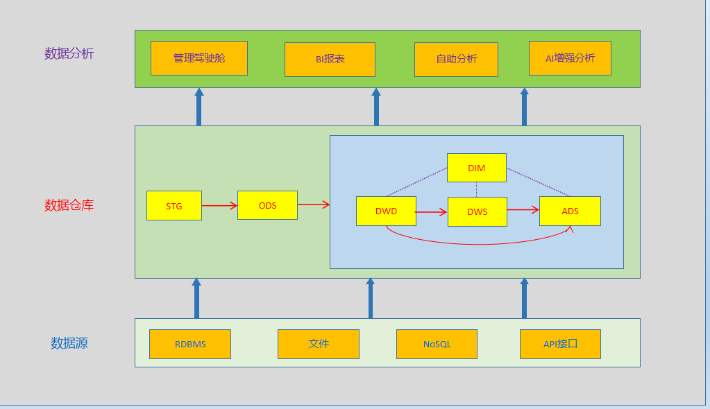
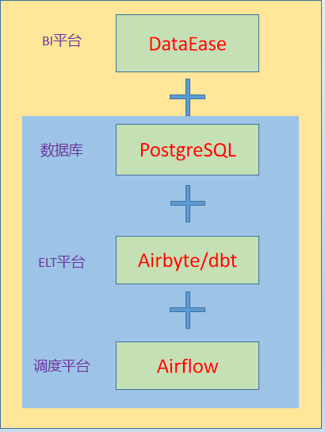

Overview
========

本项目的定位是通过研发一套成熟稳定的数据仓库系统，为公司的各项生产经营活动的决策分析提供数据支撑，从而达到降本增效赋能业务的发展的目的。

涉及的业务模块：销售、采购及生产、财务等

涉及的业务系统：SAP、POS及CRM等

Project Contents
================

1、数据架构：stg + ods + dim + dwd +dws + ads

2、技术架构：airbyte + dbt + airflow + cosmos + postgresql + git + jenkins + dataease

        1) airbyte：实现与各种数据源的对接，只需简单配置即可方便数据入湖入仓。即EL工作
		2) dbt：    针对仓内的数据进行各种清洗转换汇总等处理工作，可一键生成数据字典文档及进行单元测试。即T工作
		3) airflow：任务调度平台
		4) cosmos： 可方便Airflow和dbt的集成，通过该框架能自动识别dbt项目里任务的数据血缘及调度依赖，无需再手工一个个配置
		5) postgresql：数据库，仓库数据存放位置
		6) git：    代码版本控制
		7) jenkins：cicd集成
        8) dataease：BI平台

3、项目部署流程：  
1）从GitHub上pull项目到本地  
2）在本地项目根目录上创建虚拟环境dbt_venv,并安装项目依赖：pip install -r requirements.txt
3）如部署到生产环境，修改.env文件内容：DW_ENV=prod  
4）启动项目： astro dev start [--env .env] (如是默认的.env文件，也可不用加 --env指定环境变量文件)
